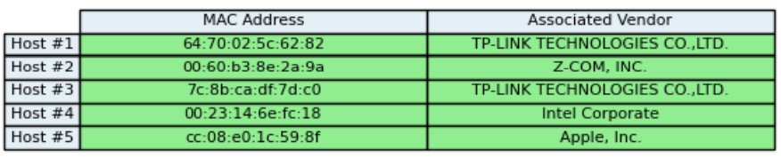
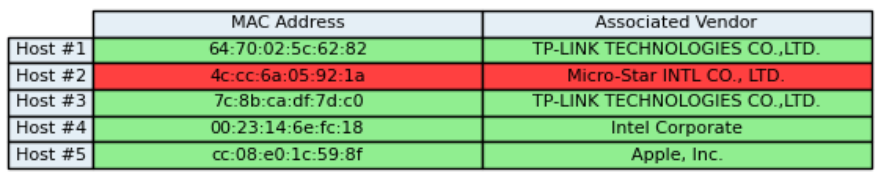
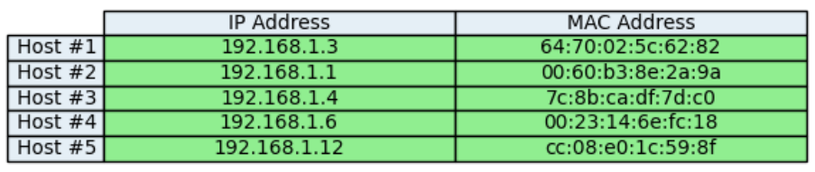
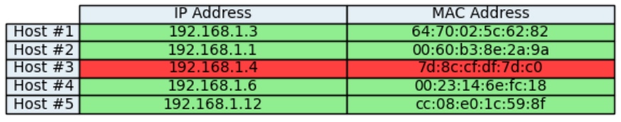
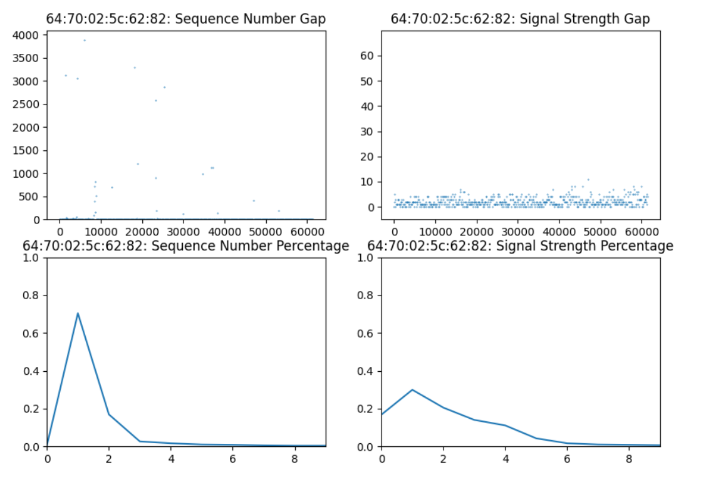
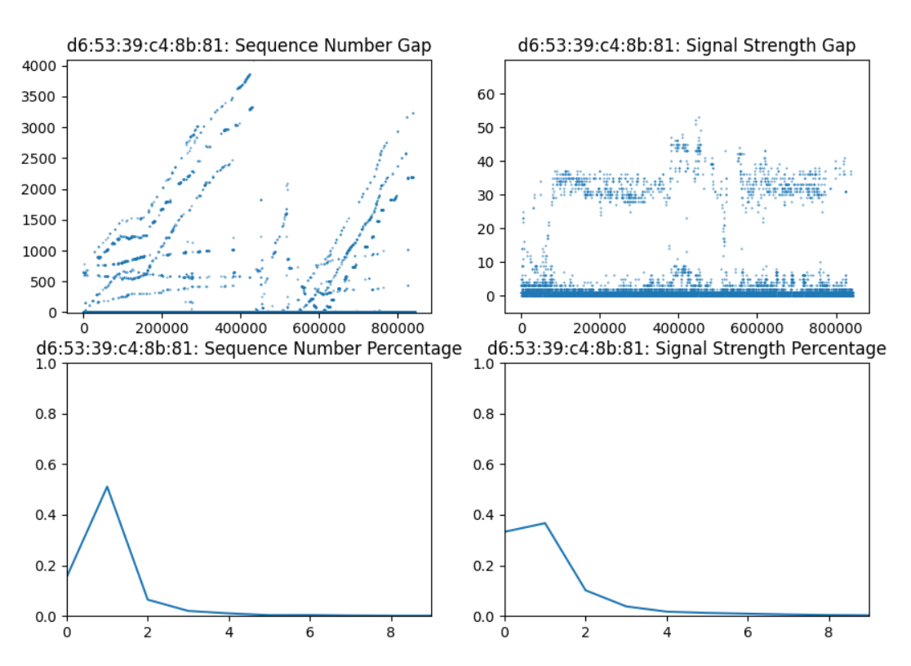

# MAC Spoofing Detection
> University Project (EECE 655 - Internet Security @ AUB) where we had to go through almost the complete research process: problem identification, literature review and problem definition, design, implementation, testing/simulation, analysis and documentation. We decided to tackle MAC spoofing detection by combinining 3 different methods.

## What is MAC Spoofing
A MAC address is unique and hard coded on a device’s NIC,
which makes this device distinctly identifiable by other devices
on the network. That being said, hackers and cyber attackers
have targeted the MAC address and have figured out several
ways to spoof it, as a precursor to their attacks, such as DoS,
DDoS, authorization spoofing, identity prevention, etc. So by
using the victim’s MAC address, the attacker can easily spoof
it and impersonate someone else to act as if it were them.

## Detection Methods
### OUI Detection
The OUI is an IEEE registration authority that assigns the
first 3 bytes of a MAC address to specific vendors. This allows
us to detect MAC spoofing based on the vendor associated
with each MAC address. We are using a ‘whitelist’ text file,
which lists the expected vendors associated with clients in our
network. We then capture packets, which will fall under one of
the two categories: (1) Mac address is valid but not whitelisted:
in this case the MAC address is associated to a valid vendor,
but this vendor is not included in our ‘whitelist’ text file. This
means that the client MAC address is most probably spoofed,
(2) Mac address valid and whitelisted: in this case the MAC
address is associated to a valid vendor, and the vendor is also
included in our ‘whitelist’ text file, meaning that it is most
probably a legitimate MAC address. It’s important to note that
OUI-based detection can be bypassed if the client is doing
MAC spoofing using a MAC address associated with one of
the whitelisted vendors.

### ARP Detection
In this method the scapy library from python will be used,
in order to construct a broadcast message with destination
“ff:ff:ff:ff:ff”, and this message will be an ARP request. Scapy
also offers the option of including a range of IP addresses that
will be returned with their corresponding MAC addresses. In
our case we will be specifying only one IP rather than a range,
that way we will be able to filter out all of the rest (unwanted)
IP/MAC pairs. We will first have the original IP/MAC pairs,
which are received from the packets (or in our case stored in
a text file). We will then send an ARP request with only the
original IP address that we have. Once we receive this IP’s
MAC address from the ARP request, we will compare this
MAC address with the original one that we had. If they are
not the same, then this MAC address is most likely spoofed,
otherwise it will most probably be a legit MAC address. It’s
important to note that this method also requires us to have a
reference ARP table available on our network, which would
either come from another device or be set-up by the network
administrator. This method can also be bypassed if IP spoofing
is used by the attacker.

### Sequence Number Detection
This method relies on the fact that in the TCP protocol, the
sequence number is always incremented by one and is modulo
4096. We analyze the sequence number in the MAC header
of wireless packets (802.11). The gap between the sequence
number of the current packet and that of a previous one should
be 1 for the same MAC address. When the gap is greater than
1, this might be an indication of a spoofed MAC address.
In practice, there are many retransmitted, lost, and duplicated
packets. Taking that into consideration, we created a method
which helps us decide if the sequence number is behaving
normally or is abnormal. This method works as follows: If
the gap is greater than 3, then it is outside the window and
abnormal. If the gap is between 1 and 3, then it is a normal,
inside the window, packet. If the gap is 0 or very large, we
check if it is a retransmission. We will do so by checking if
the current packet’s sequence number is equal to the sequence
number of any of the last 4 packets that were sent by this
MAC address.

### Signal Strength Detection
In a wireless setting, each packet has a signal strength
that can be extracted from the RadioTap header. The received
signal strength depends on many factors such as the distance
from the access point, obstruction, and transmission power of
the NIC. This method relies on the idea that signal strength
usually does not vary between a packet and the next from
the same MAC address since clients are usually stationary.
Detecting a gap above a certain threshold can be indicative
that MAC spoofing might be happening; where it will show
there are two clients with the same MAC address in different
locations. It’s important to note that to have appropriate
readings, we require almost all devices in our subnet to be
connected wirelessly to a router to be able to analyse signal
strength information.

## Testing
### OUI Detection
Concerning OUI-based detection, we ran all our tests using
a whitelist containing vendors associated with all devices’ NIC
in our subnet. The contents of this whitelist was: {TP-LINK
Technologies, Z-COM, Intel Corp., Apple Inc.}. We ran our
first test on the set of legitimate packets captured previously to
build a table of MAC addresses/Vendor pairs in our network. 
All vendors associated with devices we captured
packets from belong to our whitelist. Therefore, our algorithm
did not flag any as spoofed.

We ran our second test on the packets that contained a
spoofed MAC address. The spoofed MAC address is associated 
with an existing vendor, but is not present in our whitelist.
We built an updated table of MAC addresses/Vendor pairs in
our network. We can see that the client with a spoofed MAC
address is flagged by our algorithm, as it did not have
a vendor included in our whitelist.

### ARP Detection
Concerning ARP table comparison, we ran our tests using an established reference ARP table used to check for
abnormalities. We ran our first test on the set of legitimate
packets captured previously, and extracted from each the
source IP address and source MAC address.

All IP/MAC addresses combination matched the ARP reference
table, meaning that no client was flagged as having a spoofed
MAC address. We ran our second test on the packets that
contained a spoofed MAC address. Afterwards, we extracted
from each the source IP address and source MAC address. The client whose MAC address was spoofed was flagged
by our algorithm.

### Sequence Number and Signal Strength Detection
Concerning Sequence Number and Signal Strength detection, we analysed the non-spoofed packets, calculated all the
necessary metrics, and plotted relevant values. 

We can see that the sequence number and signal strength gap are very
close to 0 for most packets that are from a legitimate client, as
well as the percentage of gaps that are 0 and 1 is very high in
both cases. This client had a warning level of -1.6308 which
is less than -1, hence showing a valid client.
Running our code again on the packets that contained a spoofed MAC address, 
we got an error of -0.5406 which is significantly
greater than our threshold. Suspecting that it is a spoofed
MAC address, we plotted the graphs and saw variability and
a suspicious behavior which helped us be assured that it is
indeed spoofed.

